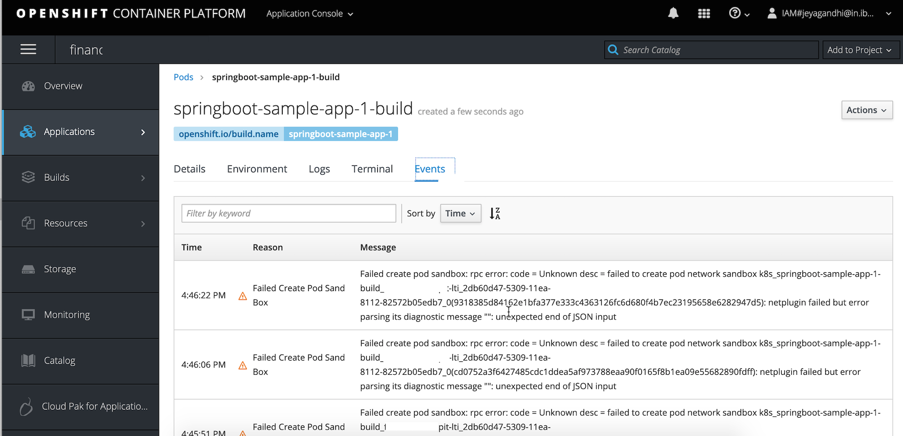
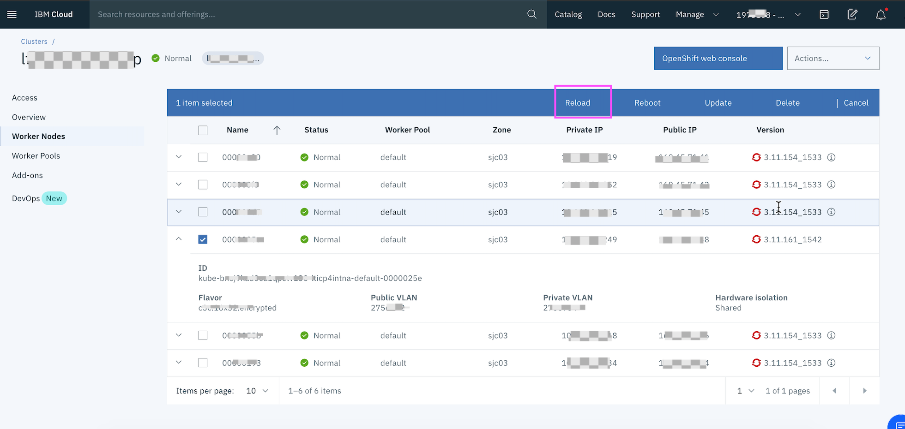

#  POD was stuck in Pod Initialization for ever in Openshift 3.11

## Tags

Openshift, Kubernetes, POD, Node, Network, 

## Problem 

All of sudden all the new pods created was stuck in pod initialization and not getting started.

The POD events shows...
```
Failed create pod sandbox: rpc error: code = Unknown desc = 
failed to create pod network sandbox k8s_g-app-store-deployment-597f589775-vwnbx_g-app-store-pro_7db63371-530a-11ea-
8112-82572b05edb7_0(b7c5d8b8407b89e460df6c10caec5473eef6f26e5eab7db0bd1fabf4f23c1d4e): 
netplugin failed but error parsing its diagnostic message "": unexpected end of JSON input
```




## Root cause

Network issue with the worker Node.

## Problem Analysis

1. POD events shows 

```
Failed create pod sandbox: rpc error: code = Unknown desc = failed to create pod network sandbox 
```

 so this could be related to some networking issues.


2. Deployed another sample app. But the same error occurring.

3. Understood that both pods are scheduled on the same worker node

```
oc get nodes -o wide
oc describe node 10.33.22.33
```

4. Through Openshift web console made that node as un-schedulable

5. Deleted the pod and the pod is recreated in another node without any issues.

6. Understood that the node is the problem.


## Solution

1.  Rebooted the node the IBM cloud web console



## Reference

https://gsicsi.slack.com/archives/CJH0UPN2D/p1570717743033800

https://gsicsi.slack.com/archives/CJH0UPN2D/p1573122497412100
