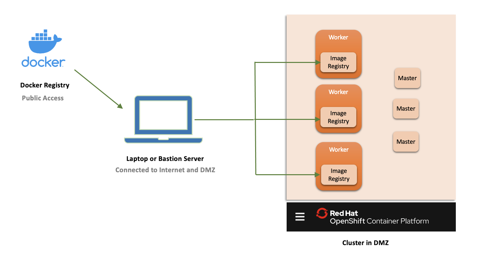

# Copying Docker Images to local registry of Openshift Nodes

This article explains about how to copy the docker images from docker hub to the local image repositry of Openshift Cluster Nodes.

- This will be useful for airgap installs. 
- Bastion server or laptop which is having both public network acceess and cluster access to be used.
- This requires cluster admin rights.
- The cluster we used here is RedHat OpenShift 4.6 on IBM Cloud (ROKS).



## 1. Preparation

#### 1.1. Download the images locally

Need to Download the images locally.

Run the below commands from CommandLine Window 1

```
docker pull instana/instana-agent-operator:1.0.5
docker pull instana/agent:latest
```

#### 1.2. Tar the images

Need to tar the images.

Run the below commands from CommandLine Window 1

```
mkdir tar
cd tar
docker save -o instana-agent-operator.tar instana/instana-agent-operator:1.0.5
docker save -o instana-agent.tar instana/agent:latest
```

#### 1.3. Get the nodes

Get the ocp cluster nodes

Run the below commands from CommandLine Window 1

```
oc get nodes
```

You may have output like this.

```
NAME          STATUS   ROLES           AGE   VERSION
10.185.2.12   Ready    master,worker   20d   v1.19.0+a5a0987
10.185.2.27   Ready    master,worker   20d   v1.19.0+a5a0987
10.185.2.38   Ready    master,worker   20d   v1.19.0+a5a0987
```

## 2. Copy to Node

* This step has to be done for all the nodes in the cluster.

#### 2.1. Get into to a node

Get into to first node. This step to be done for all the nodes.

1. Run the below commands from CommandLine Window 2

```
oc debug node/10.185.2.12
```

You might be seeing output like this.
```
Jeyas-MacBook-Pro:009-instana-airgap-install jeyagandhi$ oc debug node/10.185.2.12
Starting pod/10185212-debug ...
To use host binaries, run `chroot /host`
Pod IP: 10.185.2.12
If you don't see a command prompt, try pressing enter.
```

2. Run the below commands from CommandLine Window 2

```
chroot /host
cd /tmp
```

#### 2.2. Copy the tar files to node

Copy the tar files to node.

Run the below commands from CommandLine Window 1

Here `10185212-debug` taken from the previous output `Starting pod/10185212-debug ...`

```
oc rsync tar 10185212-debug:/host/tmp
```

This should have copied the `tar` folder content to `tmp` folder in the OCP node.

You might be seeing output like this.
```
Jeyas-MacBook-Pro:009-instana-airgap-install jeyagandhi$ oc rsync tar 10185212-debug:/host/tmp
building file list ... done
tar/
tar/instana-agent-operator.tar
tar/instana-agent.tar

sent 1223657825 bytes  received 114 bytes  4944072.48 bytes/sec
total size is 1223508115  speedup is 1.00
```

#### 2.3. Verify the files are copied

Get into to first node.

Run the below commands from CommandLine Window 2

```
ls -l /tmp/tar
```

You might be seeing output like this.
```
sh-4.2# ls -l /tmp/tar
total 1196020
-rw-------. 1 root root 408538624 May 22 13:01 instana-agent-operator.tar
-rw-------. 1 root root 814967808 May 22 13:02 instana-agent.tar
```

#### 2.4. Install PodMan in node

Install PodMan in node, for handling the docker images.

Run the below commands from CommandLine Window 2

```
su -
subscription-manager repos --enable rhel-7-server-extras-rpms
yum -y install podman
```

verify podman works
```
podman -h
```

#### 2.5. Load the image into local repository of the node

Load the image into local repository of the node

Run the below commands from CommandLine Window 2

```
cd /tmp/tar
podman load < instana-agent-operator.tar
podman load < instana-agent.tar
```

You may see the output like this...

verify podman works
```
......
Copying config 771330101a done
Writing manifest to image destination
Storing signatures
Loaded image(s): localhost/instana/instana-agent-operator:1.0.5

......
Copying config f43f02526f done
Writing manifest to image destination
Storing signatures
Loaded image(s): localhost/instana/agent:latest
```

#### 2.6. Tag the local image to the appropriate image name

The image in the local registry can be taged to the target image name, so that the target image is not required to pull from outside and it available local. 

Run the below commands from CommandLine Window 2

```
podman tag localhost/instana/instana-agent-operator:1.0.5 docker.io/instana/instana-agent-operator:1.0.5
podman tag localhost/instana/agent:latest docker.io/instana/agent:latest
```

Verify the taging using the below command 
```
podman images  |grep instana
```

The output could be like this.

```
root@kube-c279752d0qnkb1th7st0-waiops31ga2-default-000002ba tar]# podman images  |grep instana
localhost/instana/instana-agent-operator                                                        1.0.5                                      f43f02526f06   2 weeks ago     815 MB
localhost/instana/agent                                                                         latest                                     f43f02526f06   2 weeks ago     815 MB
docker.io/instana/agent                                                                         latest                                     f43f02526f06   2 weeks ago     815 MB
docker.io/instana/agent                                                                         latestpodman                               f43f02526f06   2 weeks ago     815 MB
docker.io/instana/instana-agent-operator                                                        1.0.5                                      f43f02526f06   2 weeks ago     815 MB

```


#### 2.7. Repeat the steps for all the nodes

From the step 2.1, it has to be repeated for all the nodes.

