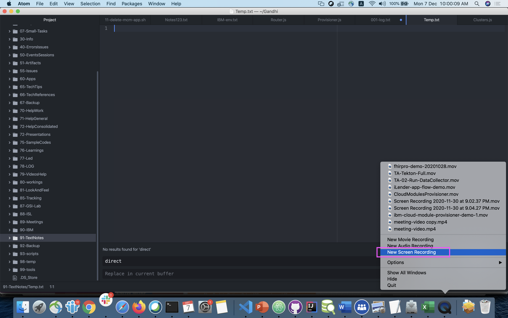

# Screen Recording in Quicktime Player

1. Open Quick time player

2. Click on `File > New Screen Recording`. Or righ click on the icon and choose the `New Screen Recording`

3. Select the FullScreen or Area to capture

4. To record audio along choose `Options>Microphone>External Microphone`

It will start teh recording..

5. Once the recording is done you can click on the a circle like icon in the top to stop the recording and then save the file.

the video file would be available in the desktop folder.
